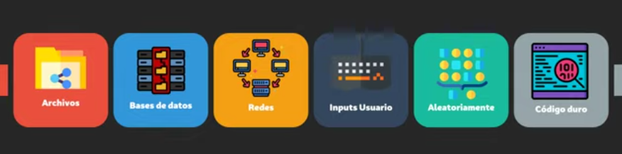

Objetos y variables
---
Ya sabemos que la mayoria de las instrucciones en un programa son declaraciones
y que esas declaraciones se organizan en funciones

Un programa puede adquirir datos con los cuales trabajar de distintos modos, a
través de un archivo, de bases de datos, a través de una red, recibir de un
usuario que los provee como un input, creados de modo aleatorio por el proprio
programa, o desde el programador que incluye datos en el codigo fuente del
mismo programa (codigo duro)



Todos los ordenadores tienen una memoria llamada RAM por las siglas de random
access memory, esta disponible para que la usen todos nuestros programas.

Un dato almacenado en cualquier lugar de la memoria se conoce como "un valor".
Antiguamente se podia acceder directamente a una ubicación en memoria. En C++
el acceso directo no está permitido, en su lugar accedemos a memoria
indirectamente a través de un objeto. Un objeto es una region de almacenamiento
en memoria que tiene un valor y otras propiedades asociadas.

Los objetos pueden tener un nombre o no, pueden ser anonimos. Un objeto con un
nombre es llamado una "variable", y el nombre que se le da a los objetos se
conoce como su "identificador"

Para crear una variable usamos un tipo especial de declaración llamada
"definición".

Los siguientes son ejemplos de definiciones  

```c++
int x; // define una variable llamada x de tipo int
```

En tiempo de compilación el compilador sabe que hemos definido una variable x
de tipo int, A partir de ese momento siempre que el complador vea el
identificador x sabrá que estamos referenciando a esta variable.

Cuando el programa se este ejecutando, lo que se llama tiempo de ejecución la
variable será instanciada, lo cual significa que el objeto ha sido creado y se
le ha asignado una posición en memoria
