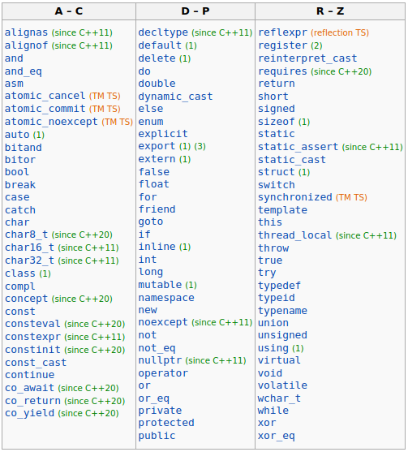

Palabras clave e identificadores de nombre:
===
Todos los lenguajes de programación cuentan con keywords, palabras clave o reservadas
c++ en la actualidad reserva 92 que se han ido añadiendo.

Cada una de estas palabras reservadas tiene un proposito para el uso de c++ y
no pueden ser usadas por el usuario como nombres de variables o funciones

This is a list of reserved keywords in C++. Since they are used by the
language, these keywords are not available for re-definition or overloading. 
https://en.cppreference.com/w/cpp/keyword



C++ tambien define otros identificadores especiales como:  
----
override  
final  
import  
module  

Reglas de nombres para identificadores
---

1) No puede ser una palabra clave. las palabras claves son reservadas.

2) El identificador solo puede estar compuesto por letras mayusculas y
minusculas, numeros y el caracter de guion bajo.

3) Debe comenzar por letra mayuscula o minuscula y guion bajo, no numeros.

4) c++ es case sensitive, lo que significa que diferencia entre mayusculas y
minusculas


Convenciones y buenas practicas
---
Al trabajar en equipo es importante determinar que convención seguir para
nombrar los identificadores y formateos de texto.
Las buenas practicas recomendadas por C++

1) Los nombres de las variables comiencen siempre por minuscula.
```
int sumav; // correcta
int Sumarv; // incorrecta
int SUMAV; // incorrecta
int SuMaV; // incorrecta
```

2) Los nombres de las funciones deberian comenzar tambien por minuscula, aunque
aqui hay mas discrepancia.


3) Los nombre de identificadores que comienzan en mayuscula son usados para
tipos de datos definidos por el usuario como pueden ser Structs, Class o Enums
```
struct Persona{...};
class Miembros{...};
enum Color{rojo, verde, azul};
```

5) Si el nombre del identificador esta formado por mas de una palabra hay dos
convenciones comunes  
    5.1) snake_case: separar las palabras por guiones bajos: mi_nombre_funcion()  
    5.2) camel_case: la primera palabra se coloca toda en minuscula y las
    siguientes palabras la primera letra es siempre una mayuscula:
    miNombreVariable()
